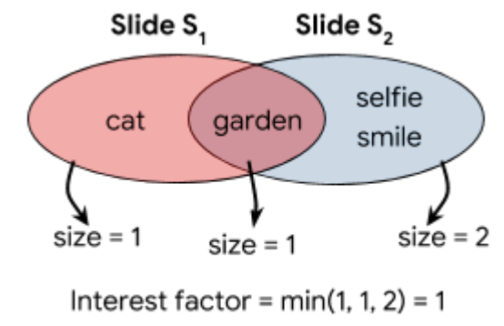

# Qual_2019

## Question

* For two subsequent slides S_i and S_i+1, the interest factor is the minimum of:
  * number of common tags between S_i and S_i+1
  * number of tags in S_i but not in S_i+1
  * number of tags in S_i+1 but not in S_i

* 90000 -> complete search x
* group hash 10

* The similarity of two veical photos on a single slide is not taken into account for score

## Solution

* combine vertical tags with union
  * verticals with minimal intersection (maybe small first?)

# LEFT 

123 + 89

# RIGHT

3456 + 78

## Submission

https://www.kaggle.com/c/hashcode-photo-slideshow/overview/evaluation